```mermaid
graph TB
    UI["Streamlit in Snowflake<br/>(streamlit_app.py)"]
    
    subgraph Processing["Processing Layer"]
        PDF["PDF Processing<br/>(PyMuPDF/fitz)<br/>• Text Extract<br/>• Image Extract"]
        AI["Cortex AI APIs<br/>• Claude<br/>• GPT-4o<br/>• Pixtral Large"]
    end
    
    subgraph Storage["Snowflake Storage Layer"]
        subgraph Tables["Tables"]
            T1["PDF_TEXT_DATA"]
            T2["IMAGE_ANALYSIS_RESULTS"]
        end
        subgraph Stages["Stages"]
            S1["PDF_IMAGES_STAGE"]
            S2["PDF_FILES_STAGE"]
        end
    end
    
    UI --> PDF
    UI --> AI
    PDF --> T1
    PDF --> S1
    AI --> T2
    
    style UI fill:#e1f5ff
    style PDF fill:#fff4e1
    style AI fill:#ffe1f5
```

# 📊 Diagram Updates Summary

All text-based ASCII diagrams have been converted to **Mermaid diagrams** which render as SVG in Markdown viewers.

---

## Files Updated

### 1. PROJECT_OVERVIEW.md

#### High-Level Architecture Diagram (Lines 59-89)
**Converted from:** Text-based box diagram  
**Converted to:** Mermaid flowchart with subgraphs

**Features:**
- Multi-layered architecture visualization
- Color-coded components
- Subgraphs for UI, Processing Layer, and Snowflake Platform
- Shows relationships between components

```mermaid
graph TB
    subgraph UI["USER INTERFACE - Streamlit Web Application"]
        Tab1["Upload & Process"]
        Tab2["View Results"]
        Tab3["Image Analysis"]
    end
    
    subgraph Processing["Processing Layer"]
        PDF["PDF Processing<br/>(PyMuPDF)<br/>• Text Extract<br/>• Image Extract"]
        AI["Cortex AI Models<br/>• Claude<br/>• GPT-4o<br/>• Pixtral"]
    end
    
    subgraph Snowflake["SNOWFLAKE DATA PLATFORM"]
        subgraph Compute["COMPUTE"]
            WH["Virtual Warehouse<br/>STREAMLIT_WH (MEDIUM)"]
        end
        subgraph Storage["STORAGE"]
            Tables["TABLES<br/>• PDF_TEXT_DATA<br/>• IMAGE_ANALYSIS_RESULTS"]
            Stages["STAGES<br/>• PDF_IMAGES_STAGE<br/>• PDF_FILES_STAGE"]
        end
    end
    
    UI --> PDF
    UI --> AI
    PDF --> Tables
    PDF --> Stages
    AI --> Tables
    WH -.powers.-> UI
    WH -.powers.-> Processing
```

#### Data Flow Diagram (Lines 93-109)
**Converted from:** Text-based sequential flow  
**Converted to:** Mermaid left-to-right flowchart

**Features:**
- Sequential data flow visualization
- Color-coded stages (Upload, Extraction, Analysis, Visualization)
- Clear step-by-step process
- Descriptive labels for each stage

---

### 2. README.md

#### Components Architecture Diagram (Lines 95-111)
**Converted from:** Simple text-based tree  
**Converted to:** Mermaid top-down flowchart

**Features:**
- Clean component hierarchy
- Color-coded by function (UI, Processing, Storage)
- Shows data flow from UI to storage
- Three main branches: Text Data, Images, and Cortex AI

---

### 3. SETUP_GUIDE.md

#### System Architecture Diagram (Lines 427-456)
**Converted from:** Text-based box diagram  
**Converted to:** Mermaid top-down flowchart with subgraphs

**Features:**
- Layered architecture view
- Clear separation of Processing and Storage layers
- Subgraphs for Tables and Stages
- Color-coded components
- Shows data flow from UI to storage

---

## Benefits of Mermaid Diagrams

### Visual Benefits
✅ **Cleaner appearance** - Professional, modern look  
✅ **Better readability** - Clear boxes, arrows, and labels  
✅ **Color coding** - Visual distinction between components  
✅ **Scalable** - Renders as SVG (scales to any size)  
✅ **Consistent** - Uniform styling across all diagrams

### Technical Benefits
✅ **Markdown native** - Renders in GitHub, GitLab, Snowflake docs  
✅ **Version control friendly** - Text-based, easy to diff  
✅ **Maintainable** - Simple syntax, easy to update  
✅ **Portable** - Works across platforms  
✅ **Accessible** - Screen reader compatible

### Platform Support
✅ GitHub - Full support  
✅ GitLab - Full support  
✅ Bitbucket - Full support  
✅ VS Code - With Mermaid extension  
✅ Confluence - With plugins  
✅ Notion - Native support  

---

## Diagram Types Used

### 1. Flowchart (graph TB/LR)
- **TB** = Top to Bottom (vertical)
- **LR** = Left to Right (horizontal)

**Used for:**
- System architecture
- Component relationships
- Data flow

### 2. Subgraphs
**Used for:**
- Grouping related components
- Creating visual hierarchy
- Showing layers (UI, Processing, Storage)

### 3. Styling
- `fill:#color` - Background colors
- `style` - Custom node styling
- Different arrow types (solid, dashed)

---

## Color Scheme

The diagrams use a consistent color scheme:

| Color | Hex Code | Usage |
|-------|----------|-------|
| Light Blue | `#e1f5ff` | UI/Interface components |
| Light Yellow | `#fff4e1` | Processing/Logic components |
| Light Pink | `#ffe1f5` | AI/ML components |
| Light Green | `#e1ffe1` | Visualization/Output |
| Pale Green | `#d4edda` | Storage/Database components |

---

## How to View Diagrams

### In GitHub/GitLab
Diagrams render automatically when viewing the markdown files.

### In VS Code
1. Install "Markdown Preview Mermaid Support" extension
2. Open markdown file
3. Click "Open Preview" (Ctrl+Shift+V)

### In Snowflake Documentation
If uploading to Snowflake docs portal, Mermaid diagrams are supported natively.

### Online Viewer
Use https://mermaid.live/ to:
- Preview diagrams
- Edit syntax
- Export as PNG/SVG
- Share with team

---

## Diagram Syntax Reference

### Basic Flowchart

### With Styling

### With Subgraphs

---

## Next Steps

### For Users
1. ✅ All diagrams now render as SVG in GitHub/GitLab
2. ✅ View documentation files to see updated diagrams
3. ✅ No action required - diagrams work automatically

### For Developers
If you need to modify diagrams:
1. Edit the Mermaid code in markdown files
2. Test in VS Code with Mermaid extension
3. Or use https://mermaid.live/ for live preview
4. Commit changes - diagrams update automatically

### Documentation
- [Mermaid Documentation](https://mermaid.js.org/)
- [Flowchart Syntax](https://mermaid.js.org/syntax/flowchart.html)
- [Styling Guide](https://mermaid.js.org/config/theming.html)

---

## Files NOT Changed

The following files had no diagrams to convert:
- ✅ `setup.sql` - SQL script (no diagrams)
- ✅ `streamlit_app.py` - Python code (no diagrams)
- ✅ `environment.yml` - Config file (no diagrams)
- ✅ `example_queries.sql` - SQL examples (no diagrams)
- ✅ `QUICK_START.md` - Step-by-step guide (no diagrams)
- ✅ `DEPLOYMENT_CHECKLIST.md` - Checklist format (no diagrams)

---

## Summary

✅ **3 files updated** with Mermaid diagrams  
✅ **4 diagrams converted** from ASCII to SVG  
✅ **100% compatibility** with GitHub, GitLab, and modern markdown viewers  
✅ **Improved visual clarity** and professional appearance  
✅ **Easier to maintain** and update in the future  

**All documentation is now ready for modern markdown platforms!** 🎉

---

*Conversion completed: October 2025*

