# 📊 Project Overview
## PDF Processing & Image Analysis for Snowflake

---

## 🎯 What This Application Does

This Streamlit in Snowflake (SiS) application provides an end-to-end solution for:

1. **Uploading PDF files** containing text and images
2. **Extracting text** and storing it in Snowflake tables
3. **Extracting images** and storing them in Snowflake stages
4. **Analyzing images** using Snowflake Cortex AI models
5. **Identifying visual cues** for property assessment

### Specific Detection Capabilities

| Visual Cue | Description | Business Value |
|------------|-------------|----------------|
| 🏠 For Sale Signs | Detects "For Sale" signs in property photos | Market analysis, competitive intelligence |
| ☀️ Solar Panels | Identifies solar panel installations | Energy assessment, property valuation |
| 👥 Human Presence | Detects people in images | Occupancy verification, privacy compliance |
| ⚠️ Property Damage | Identifies visible damage or issues | Risk assessment, insurance evaluation |

---

## 📁 Project Structure

```
Consolidated Analytics/
│
├── 🚀 QUICK START FILES
│   ├── QUICK_START.md              ⚡ Deploy in 10 minutes
│   └── DEPLOYMENT_CHECKLIST.md     📋 Step-by-step deployment
│
├── 📚 DOCUMENTATION
│   ├── README.md                   📖 Project overview & features
│   ├── SETUP_GUIDE.md              🔧 Complete setup guide
│   └── PROJECT_OVERVIEW.md         📊 This file
│
├── 💻 APPLICATION CODE
│   ├── streamlit_app.py            🎨 Main Streamlit application
│   ├── setup.sql                   🗄️ Database setup script
│   └── environment.yml             📦 Python dependencies
│
├── 🔍 EXAMPLES & QUERIES
│   ├── example_queries.sql         📊 Sample SQL queries
│   └── Completed_Product_(Image)_00148568.pdf  📄 Sample PDF
│
└── 🎉 READY TO DEPLOY!
```

---

## 🏗️ System Architecture

### High-Level Architecture

```mermaid
graph TB
    subgraph UI["USER INTERFACE - Streamlit Web Application"]
        Tab1["Upload & Process"]
        Tab2["View Results"]
        Tab3["Image Analysis"]
    end
    
    subgraph Processing["Processing Layer"]
        PDF["PDF Processing<br/>(PyMuPDF)<br/>• Text Extract<br/>• Image Extract"]
        AI["Cortex AI Models<br/>• Claude<br/>• GPT-4o<br/>• Pixtral"]
    end
    
    subgraph Snowflake["SNOWFLAKE DATA PLATFORM"]
        subgraph Compute["COMPUTE"]
            WH["Virtual Warehouse<br/>STREAMLIT_WH (MEDIUM)"]
        end
        subgraph Storage["STORAGE"]
            Tables["TABLES<br/>• PDF_TEXT_DATA<br/>• IMAGE_ANALYSIS_RESULTS"]
            Stages["STAGES<br/>• PDF_IMAGES_STAGE<br/>• PDF_FILES_STAGE"]
        end
    end
    
    UI --> PDF
    UI --> AI
    PDF --> Tables
    PDF --> Stages
    AI --> Tables
    WH -.powers.-> UI
    WH -.powers.-> Processing
```



### Data Flow


---

## 🗄️ Database Schema

### Tables

#### PDF_TEXT_DATA
Stores extracted text from PDF files.

| Column | Type | Description |
|--------|------|-------------|
| ID | NUMBER | Auto-increment primary key |
| FILE_NAME | STRING | Name of the PDF file |
| PAGE_NUMBER | NUMBER | Page number in PDF |
| EXTRACTED_TEXT | STRING | Full text from page |
| UPLOAD_TIMESTAMP | TIMESTAMP | When text was extracted |
| METADATA | VARIANT | Additional metadata (JSON) |

#### IMAGE_ANALYSIS_RESULTS
Stores AI analysis results for images.

| Column | Type | Description |
|--------|------|-------------|
| ID | NUMBER | Auto-increment primary key |
| FILE_NAME | STRING | Original PDF file name |
| IMAGE_NAME | STRING | Image file name in stage |
| MODEL_NAME | STRING | AI model used (claude, gpt-4o, pixtral) |
| PAGE_NUMBER | NUMBER | Page number from PDF |
| FOR_SALE_SIGN_DETECTED | BOOLEAN | For sale sign detected? |
| FOR_SALE_SIGN_CONFIDENCE | FLOAT | Confidence (0-100) |
| SOLAR_PANEL_DETECTED | BOOLEAN | Solar panels detected? |
| SOLAR_PANEL_CONFIDENCE | FLOAT | Confidence (0-100) |
| HUMAN_PRESENCE_DETECTED | BOOLEAN | People detected? |
| HUMAN_PRESENCE_CONFIDENCE | FLOAT | Confidence (0-100) |
| POTENTIAL_DAMAGE_DETECTED | BOOLEAN | Damage detected? |
| POTENTIAL_DAMAGE_CONFIDENCE | FLOAT | Confidence (0-100) |
| DAMAGE_DESCRIPTION | STRING | Description of damage |
| FULL_ANALYSIS_TEXT | STRING | Complete AI response |
| ANALYSIS_TIMESTAMP | TIMESTAMP | When analysis was performed |
| METADATA | VARIANT | Additional metadata (JSON) |

### Stages

#### PDF_IMAGES_STAGE
Internal stage storing extracted images from PDFs.

**Purpose**: Stores image files (PNG, JPG) extracted from PDFs  
**Directory enabled**: YES  
**Access**: READ/WRITE for application users

#### PDF_FILES_STAGE
Internal stage for uploaded PDF files.

**Purpose**: Stores original PDF files for reference  
**Directory enabled**: YES  
**Access**: READ/WRITE for application users

---

## 🤖 AI Models Integration

### Snowflake Cortex AI

The application integrates with Snowflake Cortex AI to provide image analysis capabilities.

| Model | API Name | Strengths | Best For |
|-------|----------|-----------|----------|
| **Claude 3.5 Sonnet** | `claude-3-5-sonnet` | Complex reasoning, detailed analysis | Nuanced property descriptions |
| **GPT-4o** | `gpt-4o` | Balanced performance, general-purpose | All-around image analysis |
| **Pixtral Large** | `pixtral-large` | Visual understanding, image analysis | ⭐ **Recommended** for property images |

### Analysis Process

1. Image extracted from PDF → Saved to stage
2. Image path passed to Cortex model
3. Model receives prompt with analysis categories
4. Model returns JSON with detections and confidence scores
5. Results parsed and saved to database

---

## 🎨 User Interface

### Three Main Tabs

#### 1️⃣ Upload & Process
- File upload widget
- Extract Text button
- Extract Images button
- Run Image Analysis button
- Real-time progress indicators

#### 2️⃣ View Results
- **Left Panel**: Extracted text records
  - Searchable table
  - Download as CSV
  - Preview text content
  
- **Right Panel**: Extracted images
  - List of images in stage
  - File sizes and timestamps
  - Image count metrics

#### 3️⃣ Image Analysis
- **Summary Metrics** (4 cards)
  - 🏠 For Sale Signs count
  - ☀️ Solar Panels count
  - 👥 Human Presence count
  - ⚠️ Potential Damage count

- **Detailed Results Table**
  - All detections with confidence scores
  - Filterable by category
  - Download as CSV
  - Sortable columns

### Sidebar Configuration
- AI Model selector
- Database/Schema information
- Analysis categories reference
- Real-time status indicators

---

## 🔧 Configuration Options

### Application Configuration

Edit in `streamlit_app.py`:

```python
# Lines 26-31: Database objects
DATABASE = "PDF_ANALYTICS_DB"
SCHEMA = "PDF_PROCESSING"
TEXT_TABLE = "PDF_TEXT_DATA"
ANALYSIS_TABLE = "IMAGE_ANALYSIS_RESULTS"
IMAGE_STAGE = "PDF_IMAGES_STAGE"
PDF_STAGE = "PDF_FILES_STAGE"

# Lines 34-38: Available models
AVAILABLE_MODELS = {
    "Claude (Anthropic)": "claude-3-5-sonnet",
    "GPT-4 (OpenAI)": "gpt-4o",
    "Pixtral Large (Mistral)": "pixtral-large"
}

# Lines 41-72: Analysis prompt
ANALYSIS_PROMPT = """..."""  # Customize detection categories
```

### Warehouse Configuration

```sql
-- Adjust size based on usage
ALTER WAREHOUSE STREAMLIT_WH 
SET WAREHOUSE_SIZE = 'SMALL' | 'MEDIUM' | 'LARGE';

-- Adjust auto-suspend (seconds)
ALTER WAREHOUSE STREAMLIT_WH 
SET AUTO_SUSPEND = 60;  -- 1 minute recommended
```

---

## 📊 Example Use Cases

### 1. Real Estate Assessment
**Scenario**: Real estate company needs to analyze hundreds of property photos

**Workflow**:
1. Upload property inspection PDFs
2. Extract all property images
3. Analyze with Pixtral Large model
4. Filter results to show only properties with damage
5. Export damage report as CSV

**SQL Query**:
```sql
SELECT FILE_NAME, DAMAGE_DESCRIPTION, POTENTIAL_DAMAGE_CONFIDENCE
FROM IMAGE_ANALYSIS_RESULTS
WHERE POTENTIAL_DAMAGE_DETECTED = TRUE
ORDER BY POTENTIAL_DAMAGE_CONFIDENCE DESC;
```

### 2. Solar Installation Tracking
**Scenario**: Utility company tracking solar panel installations

**Workflow**:
1. Upload aerial property survey PDFs
2. Extract images and analyze
3. Identify properties with solar panels
4. Generate report of solar installations by neighborhood

**SQL Query**:
```sql
SELECT FILE_NAME, COUNT(*) as SOLAR_IMAGES
FROM IMAGE_ANALYSIS_RESULTS
WHERE SOLAR_PANEL_DETECTED = TRUE
GROUP BY FILE_NAME;
```

### 3. Property Insurance Risk
**Scenario**: Insurance company assessing property risk

**Workflow**:
1. Upload property inspection reports
2. Analyze images for damage indicators
3. Calculate risk scores
4. Flag high-risk properties for review

**SQL Query**:
```sql
SELECT 
    FILE_NAME,
    SUM(CASE WHEN POTENTIAL_DAMAGE_DETECTED THEN 1 ELSE 0 END) as DAMAGE_COUNT,
    AVG(POTENTIAL_DAMAGE_CONFIDENCE) as AVG_CONFIDENCE
FROM IMAGE_ANALYSIS_RESULTS
GROUP BY FILE_NAME
HAVING DAMAGE_COUNT > 2
ORDER BY AVG_CONFIDENCE DESC;
```

---

## 🚀 Getting Started

### For First-Time Users
1. Start with **QUICK_START.md** (10 minutes)
2. Test with sample PDF
3. Explore the UI
4. Try example queries

### For Detailed Setup
1. Read **SETUP_GUIDE.md** (complete guide)
2. Follow **DEPLOYMENT_CHECKLIST.md** (step-by-step)
3. Customize as needed
4. Deploy to production

### For Developers
1. Review `streamlit_app.py` (application code)
2. Examine `setup.sql` (database schema)
3. Study `example_queries.sql` (data access patterns)
4. Customize and extend

---

## 📈 Performance Expectations

### Processing Times (Typical)

| Operation | Small (10-page PDF, 5 images) | Large (50-page PDF, 25 images) |
|-----------|-------------------------------|--------------------------------|
| Text Extraction | < 10 seconds | < 30 seconds |
| Image Extraction | < 15 seconds | < 60 seconds |
| Image Analysis | ~30 seconds per image | ~2.5 minutes per image |
| Results Display | < 2 seconds | < 5 seconds |

### Warehouse Sizing Guide

| Warehouse Size | Concurrent Users | PDF Size | Cost Impact |
|----------------|-----------------|----------|-------------|
| SMALL | 1-5 | < 20 pages | Lowest |
| MEDIUM | 5-20 | 20-100 pages | Moderate |
| LARGE | 20+ | 100+ pages | Higher |

---

## 🔐 Security Considerations

### Data Protection
- ✅ All data stored in Snowflake (enterprise-grade security)
- ✅ Role-based access control (RBAC)
- ✅ Encrypted at rest and in transit
- ✅ Audit logging available

### Access Control
- ✅ Streamlit app access controlled by Snowflake roles
- ✅ Database/schema permissions granular
- ✅ Stage access restricted to authorized roles
- ✅ Cortex AI usage tracked

### Compliance
- ✅ GDPR compliant (Snowflake platform)
- ✅ SOC 2 Type II certified
- ✅ HIPAA eligible (with appropriate configuration)
- ✅ Data residency controls available

---

## 🆘 Support Resources

### Documentation Files
- `README.md` - Feature overview and quick reference
- `SETUP_GUIDE.md` - Complete setup with troubleshooting
- `QUICK_START.md` - 10-minute deployment guide
- `DEPLOYMENT_CHECKLIST.md` - Step-by-step checklist
- `example_queries.sql` - Sample SQL queries

### External Resources
- [Snowflake Documentation](https://docs.snowflake.com/)
- [Streamlit Documentation](https://docs.streamlit.io/)
- [Cortex AI Documentation](https://docs.snowflake.com/en/user-guide/ml-functions/cortex)
- [PyMuPDF Documentation](https://pymupdf.readthedocs.io/)

### Getting Help
1. Check documentation files
2. Review troubleshooting section in SETUP_GUIDE.md
3. Visit Snowflake Community forums
4. Contact your Snowflake account team

---

## 🎉 Next Steps

### Immediate Actions
1. ✅ Review `QUICK_START.md` for deployment
2. ✅ Run `setup.sql` to create database objects
3. ✅ Deploy `streamlit_app.py` to Snowflake
4. ✅ Test with sample PDF

### Short-Term Goals
1. ✅ Process your first batch of PDFs
2. ✅ Compare different AI models
3. ✅ Create custom queries for your use case
4. ✅ Share with team members

### Long-Term Opportunities
1. 🔮 Customize detection categories for your industry
2. 🔮 Integrate with existing data pipelines
3. 🔮 Build automated workflows with Snowflake Tasks
4. 🔮 Create custom dashboards in BI tools

---

## 📝 Version Information

- **Version**: 1.0
- **Release Date**: October 2025
- **Snowflake Version**: Compatible with all current versions
- **Python Version**: 3.10+
- **Streamlit Version**: 1.28+

---

## 🙏 Credits

**Built with:**
- Snowflake (Data Cloud Platform)
- Snowflake Cortex AI (Claude, GPT-4o, Pixtral Large)
- Streamlit (Python web framework)
- PyMuPDF (PDF processing)
- Pillow (Image processing)

**Template Reference:**
- [Snowflake Intelligence Solutions](https://github.com/sfc-gh-sdickson/GoDaddy)

---

**Ready to transform your PDF processing workflow? Get started now!** 🚀

👉 Begin with: `QUICK_START.md`

