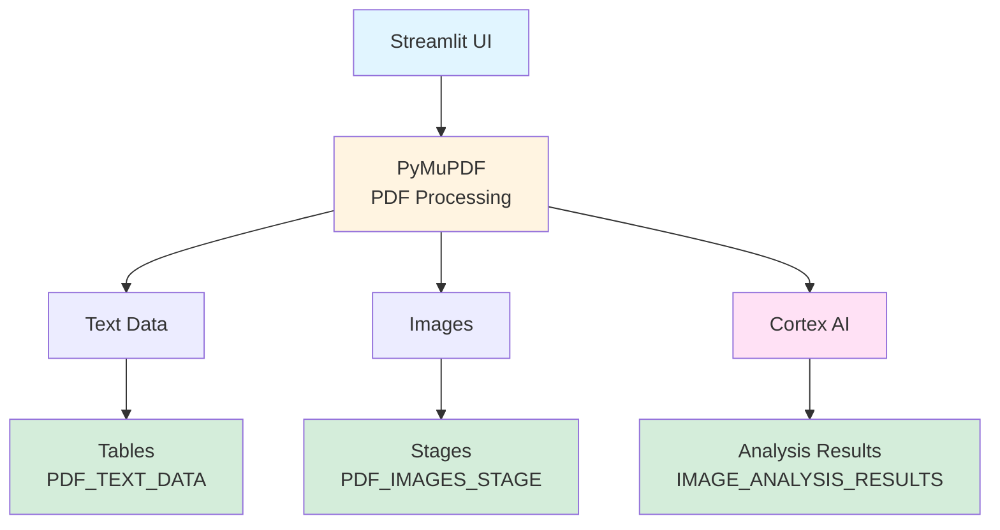

# 📄 PDF Processing & Image Analysis Application

**Streamlit in Snowflake (SiS) Application for Property Assessment**

Extract text and images from PDF files, store them in Snowflake, and leverage Cortex AI models to analyze property images for specific visual cues.

---

## 🎯 Features

### Core Capabilities
- ✅ **PDF Text Extraction**: Extract and store text from PDF documents in Snowflake tables
- ✅ **PDF Image Extraction**: Extract and store images in Snowflake internal stages
- ✅ **AI-Powered Image Analysis**: Use Snowflake Cortex AI models for intelligent analysis
- ✅ **Multi-Model Support**: Choose from Claude, GPT-4o, or Pixtral Large models
- ✅ **Property Assessment**: Automated detection of key visual cues

### Visual Analysis Categories

The application analyzes property images for:

| Category | Description | Output |
|----------|-------------|--------|
| 🏠 **For Sale Signs** | Detects "For Sale" signs in property images | Detection + Confidence Score |
| ☀️ **Solar Panels** | Identifies solar panel installations | Detection + Confidence Score |
| 👥 **Human Presence** | Detects people in property images | Detection + Confidence Score |
| ⚠️ **Potential Damage** | Identifies visible property damage | Detection + Description + Confidence |

---

## 🚀 Quick Start

### Prerequisites
- Snowflake account with Cortex AI access
- Role with CREATE DATABASE, CREATE STREAMLIT privileges
- Basic familiarity with Snowsight interface

### Installation (5 minutes)

1. **Run Setup Script**
   ```sql
   -- Copy and execute setup.sql in Snowsight
   -- Creates: Database, Schema, Tables, Stages
   ```

2. **Create Streamlit App**
   - Navigate to **Streamlit** in Snowsight
   - Click **+ Streamlit App**
   - Copy code from `streamlit_app.py`
   - Add packages: `PyMuPDF`, `Pillow`

3. **Test the App**
   - Upload a PDF file
   - Extract text and images
   - Run analysis with your preferred AI model

📖 **For detailed instructions, see [SETUP_GUIDE.md](SETUP_GUIDE.md)**

---

## 💻 Usage

### Basic Workflow

```
1. Upload PDF → 2. Extract Content → 3. Analyze Images → 4. View Results
```

#### Step 1: Upload PDF File
- Navigate to **Upload & Process** tab
- Click "Choose a PDF file"
- Select your PDF document

#### Step 2: Extract Content
- **Extract Text**: Click to extract and save text to Snowflake table
- **Extract Images**: Click to extract and save images to Snowflake stage

#### Step 3: Analyze Images
- Select AI model from sidebar (Claude, GPT-4o, or Pixtral Large)
- Click **Run Image Analysis**
- Wait for completion (progress bar shows status)

#### Step 4: View Results
- **View Results** tab: See extracted text and images
- **Image Analysis** tab: View detection results with confidence scores
- Filter by detection type
- Download results as CSV

---

## 🏗️ Architecture

### Components



### Snowflake Objects Created

| Type | Name | Purpose |
|------|------|---------|
| Database | `PDF_ANALYTICS_DB` | Main database container |
| Schema | `PDF_PROCESSING` | Contains all objects |
| Table | `PDF_TEXT_DATA` | Stores extracted text |
| Table | `IMAGE_ANALYSIS_RESULTS` | Stores AI analysis results |
| Stage | `PDF_IMAGES_STAGE` | Stores extracted images |
| Stage | `PDF_FILES_STAGE` | Stores uploaded PDFs |
| View | `VW_LATEST_IMAGE_ANALYSIS` | Latest analysis per image |

---

## 📊 Sample Queries

### View All Extracted Text
```sql
SELECT * 
FROM PDF_ANALYTICS_DB.PDF_PROCESSING.PDF_TEXT_DATA
ORDER BY UPLOAD_TIMESTAMP DESC;
```

### Find Properties with Damage
```sql
SELECT 
    FILE_NAME,
    IMAGE_NAME,
    DAMAGE_DESCRIPTION,
    POTENTIAL_DAMAGE_CONFIDENCE
FROM PDF_ANALYTICS_DB.PDF_PROCESSING.IMAGE_ANALYSIS_RESULTS
WHERE POTENTIAL_DAMAGE_DETECTED = TRUE
ORDER BY POTENTIAL_DAMAGE_CONFIDENCE DESC;
```

### Count Solar Panel Detections by File
```sql
SELECT 
    FILE_NAME,
    COUNT(*) as IMAGES_WITH_SOLAR
FROM PDF_ANALYTICS_DB.PDF_PROCESSING.IMAGE_ANALYSIS_RESULTS
WHERE SOLAR_PANEL_DETECTED = TRUE
GROUP BY FILE_NAME;
```

More examples in `example_queries.sql`

---

## 🤖 AI Models

### Available Models

| Model | Best For | Use Case |
|-------|----------|----------|
| **Claude 3.5 Sonnet** | Complex text analysis | Detailed property descriptions |
| **GPT-4o** | Balanced performance | General-purpose analysis |
| **Pixtral Large** | Visual understanding | ⭐ **Recommended** for property images |

### Model Selection
Choose your model in the sidebar:
- **Pixtral Large**: Best for image-heavy analysis (recommended)
- **Claude**: Best for nuanced text understanding
- **GPT-4o**: Best for balanced text and image analysis

---

## 🔧 Configuration

### Warehouse Sizing

| Size | Use Case | Users |
|------|----------|-------|
| SMALL | Testing, light usage | 1-5 |
| MEDIUM | Production use | 5-20 |
| LARGE | Heavy processing | 20+ |

### Customization

Edit `streamlit_app.py` to customize:
- Database/Schema names (lines 26-31)
- AI models available (lines 34-38)
- Analysis prompt (lines 41-72)
- UI layout and styling

---

## 🔍 Example Use Cases

### Real Estate Assessment
- Automatically scan property photos for condition issues
- Identify properties with solar installations
- Detect marketing signage (For Sale signs)

### Property Insurance
- Document and analyze property damage
- Assess risk factors from visual inspection
- Track property condition over time

### Property Management
- Monitor property occupancy (human presence)
- Track maintenance needs (damage detection)
- Identify unauthorized modifications

---

## 📁 Project Structure

```
Consolidated Analytics/
├── streamlit_app.py           # Main Streamlit application
├── setup.sql                  # Database setup script
├── environment.yml            # Python dependencies
├── SETUP_GUIDE.md            # Detailed setup instructions
├── README.md                 # This file
├── example_queries.sql       # Sample SQL queries
└── Completed_Product_(Image)_00148568.pdf  # Sample PDF
```

---

## 🛠️ Troubleshooting

### Common Issues

**Module not found: PyMuPDF**
- Solution: Add `PyMuPDF` in Streamlit app Packages tab

**Permission denied on stage**
- Solution: Grant READ, WRITE permissions on stages to your role

**Cortex model not available**
- Solution: Verify Cortex AI is enabled in your region/account

**App runs slowly**
- Solution: Increase warehouse size to MEDIUM or LARGE

📖 **For more troubleshooting, see [SETUP_GUIDE.md](SETUP_GUIDE.md#troubleshooting)**

---

## 📚 Documentation

- **[SETUP_GUIDE.md](SETUP_GUIDE.md)** - Complete setup and configuration guide
- **[setup.sql](setup.sql)** - Database setup script with comments
- **[environment.yml](environment.yml)** - Python dependencies
- **[example_queries.sql](example_queries.sql)** - Sample SQL queries

### External Resources
- [Snowflake Cortex AI Documentation](https://docs.snowflake.com/en/user-guide/ml-functions/cortex)
- [Streamlit in Snowflake Documentation](https://docs.snowflake.com/en/developer-guide/streamlit/about-streamlit)
- [PyMuPDF Documentation](https://pymupdf.readthedocs.io/)

---

## 🎯 Success Metrics

After setup, you should achieve:
- ✅ Text extraction in seconds
- ✅ Image extraction and storage to Snowflake stage
- ✅ AI analysis with confidence scores
- ✅ Filterable results in interactive UI
- ✅ CSV export for external analysis

---

## 🆘 Support

### Getting Help
1. Review [SETUP_GUIDE.md](SETUP_GUIDE.md) for detailed instructions
2. Check [Snowflake Documentation](https://docs.snowflake.com/)
3. Visit [Snowflake Community](https://community.snowflake.com/)
4. Contact your Snowflake account team

### Reporting Issues
When reporting issues, include:
- Snowflake account region
- Cortex AI models available
- Error messages from Streamlit logs
- Warehouse size being used

---

## 🔄 Version History

### Version 1.0 (October 2025)
- Initial release
- PDF text extraction
- PDF image extraction
- Multi-model Cortex AI integration
- Property assessment analysis (4 categories)
- Interactive Streamlit UI
- CSV export functionality

---

## 📄 License

This application is provided as-is for use with Snowflake accounts. Modify and customize as needed for your use case.

---

## 🙏 Acknowledgments

Built with:
- **Snowflake**: Data platform and Cortex AI
- **Streamlit**: Python web framework
- **PyMuPDF**: PDF processing library
- **Pillow**: Image processing library

Template based on: [Snowflake Intelligence Solutions](https://github.com/sfc-gh-sdickson/GoDaddy)

---

## 🚀 Next Steps

1. ✅ Complete setup using [SETUP_GUIDE.md](SETUP_GUIDE.md)
2. ✅ Upload your first PDF and test extraction
3. ✅ Run image analysis with different AI models
4. ✅ Query results using SQL
5. ✅ Customize for your specific use case

---

**Ready to get started?** 👉 Follow the [SETUP_GUIDE.md](SETUP_GUIDE.md)

---

*Built for Snowflake Intelligence Solutions*  
*Last Updated: October 2025*

