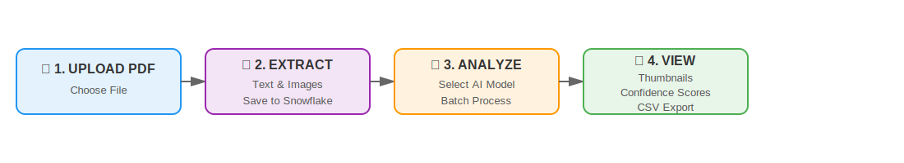
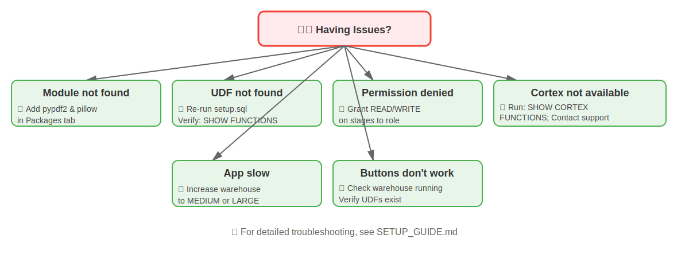
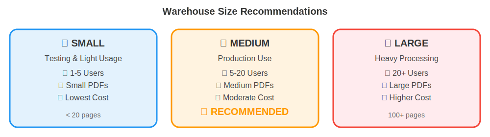

# PDF Processing & Image Analysis Application

**Streamlit in Snowflake (SiS) - Property Assessment Solution**

A complete Snowflake-native application for extracting text and images from PDF files and using Cortex AI to analyze property images for visual cues like For Sale signs, solar panels, human presence, and potential damage.

---

## 🎯 What This Application Does

- ✅ **PDF Upload & Storage**: Upload PDFs directly to Snowflake stages
- ✅ **Text Extraction**: Extract text using Snowflake Python UDFs with PyPDF2
- ✅ **Image Extraction**: Extract and store images in Snowflake internal stages
- ✅ **AI-Powered Analysis**: Use Cortex AI (Claude, GPT-4o, Pixtral Large) for intelligent image analysis
- ✅ **Property Assessment**: Automated detection of key visual cues with confidence scores
- ✅ **Interactive UI**: Streamlit interface with visual thumbnails, batch processing, and CSV exports

### Detection Categories


---

## ⚡ Quick Start (10 Minutes)


### Prerequisites
- Snowflake account with Cortex AI access
- Role with CREATE DATABASE, CREATE STREAMLIT privileges
- Access to Snowsight interface

### Step 1: Run Setup Script (2 min)
1. Open Snowsight → **Worksheets**
2. Create new worksheet
3. Copy entire contents of `setup.sql`
4. Click **Run All**

```sql
-- Verify setup
SHOW TABLES IN SCHEMA PDF_ANALYTICS_DB.PDF_PROCESSING;
SHOW FUNCTIONS IN SCHEMA PDF_ANALYTICS_DB.PDF_PROCESSING;
```

### Step 2: Create Warehouse (1 min)
```sql
CREATE WAREHOUSE IF NOT EXISTS STREAMLIT_WH
    WAREHOUSE_SIZE = 'MEDIUM'
    AUTO_SUSPEND = 60
    AUTO_RESUME = TRUE;
```

### Step 3: Create Streamlit App (3 min)
1. In Snowsight → **Streamlit** (left sidebar)
2. Click **+ Streamlit App**
3. Configure:
   - **App name**: `PDF_Processing_App`
   - **Database**: `PDF_ANALYTICS_DB`
   - **Schema**: `PDF_PROCESSING`
   - **Warehouse**: `STREAMLIT_WH`
4. Click **Create**

### Step 4: Add Application Code (2 min)
1. Delete default code in editor
2. Copy entire contents of `streamlit_app.py`
3. Paste into editor
4. Click **Run**

### Step 5: Install Dependencies (2 min)
**Method A: Packages Tab (Recommended)**
1. Click **Packages** tab
2. Add: `PyMuPDF` and `Pillow`
3. Save → App restarts

**Method B: Environment File**
1. Click **Settings** → Upload `environment.yml`
2. Save → App restarts

### Step 6: Test (Immediately)
1. Go to **Upload & Process** tab
2. Upload `Completed_Product_(Image)_00148568.pdf`
3. Click **Extract Text** → **Extract Images**
4. Select **Pixtral Large** model from sidebar
5. Click **Analyze Images (Batch)**
6. View results in **Analysis Results** tab

---

## 🏗️ Architecture

### System Overview


### Snowflake Objects

| Type | Name | Purpose |
|------|------|---------|
| Database | `PDF_ANALYTICS_DB` | Main database container |
| Schema | `PDF_PROCESSING` | Contains all objects |
| Table | `PDF_TEXT_DATA` | Stores extracted text |
| Table | `IMAGE_ANALYSIS_RESULTS` | Stores AI analysis results |
| Table | `APP_CONFIG` | Stores custom analysis categories |
| Stage | `PDF_IMAGES_STAGE` | Stores extracted images |
| Stage | `PDF_FILES_STAGE` | Stores uploaded PDFs |
| UDF | `EXTRACT_PDF_TEXT()` | Extracts text using PyPDF2 |
| UDF | `GET_PDF_IMAGE_COUNT()` | Counts images in PDF |

---

## 🤖 AI Models


---

## 💻 Basic Usage



**Detailed Steps:**

1. **Upload PDF**: Navigate to **Upload & Process** tab, select PDF file
2. **Extract Content**: Click **Extract Text** and **Extract Images**
3. **Analyze Images**: Select AI model, click **Analyze Images (Batch)**
4. **View Results**: See detection results with confidence scores and thumbnails

### Key Features

- **Manual Analysis Categories**: Add custom categories beyond defaults
- **Batch Processing**: Parallel image analysis with configurable batch size (1-10 images)
- **Image Thumbnails**: Visual results display with thumbnails loaded from Snowflake stages
- **Progress Tracking**: Real-time progress bars and status updates
- **CSV Export**: Download results as CSV files

---

## 📁 Project Structure

```
Consolidated Analytics/
├── README.md                  # This file - Project overview & quick start
├── SETUP_GUIDE.md             # Detailed setup & troubleshooting
├── streamlit_app.py           # Main Streamlit application
├── setup.sql                  # Database setup script with UDFs
├── environment.yml            # Python dependencies
├── example_queries.sql        # Sample SQL queries
└── Completed_Product_(Image)_00148568.pdf  # Sample PDF
```

---

## 🔍 Example Use Cases

### Real Estate Assessment
- Automatically scan property photos for condition issues
- Identify properties with solar installations
- Detect marketing signage

### Property Insurance
- Document and analyze property damage
- Assess risk factors from visual inspection
- Track property condition over time

### Property Management
- Monitor property occupancy (human presence)
- Track maintenance needs (damage detection)
- Identify unauthorized modifications

---

## 🛠️ Quick Troubleshooting



📖 **For detailed troubleshooting, see [SETUP_GUIDE.md](SETUP_GUIDE.md)**

---

## 🔧 Configuration

### Warehouse Sizing



### Customization

Edit `streamlit_app.py` to customize:
- Database/Schema names (lines 34-39)
- AI models available (lines 42-46)
- Analysis prompt (lines 56-101)
- UI layout and styling

---

## 📚 Documentation & Support

### Documentation Files
- **[SETUP_GUIDE.md](SETUP_GUIDE.md)** - Complete setup, deployment, and detailed troubleshooting
- **[setup.sql](setup.sql)** - Database setup script with UDFs
- **[environment.yml](environment.yml)** - Python dependencies
- **[example_queries.sql](example_queries.sql)** - Sample SQL queries

### External Resources
- [Snowflake Cortex AI Documentation](https://docs.snowflake.com/en/user-guide/ml-functions/cortex)
- [Streamlit in Snowflake Documentation](https://docs.snowflake.com/en/developer-guide/streamlit/about-streamlit)
- [PyMuPDF Documentation](https://pymupdf.readthedocs.io/)
- [Pillow Documentation](https://pillow.readthedocs.io/)

### Getting Help
1. Review `SETUP_GUIDE.md` for detailed instructions
2. Check [Snowflake Documentation](https://docs.snowflake.com/)
3. Visit [Snowflake Community](https://community.snowflake.com/)
4. Contact your Snowflake account team

---

## 🔄 Version History

### Version 1.0 (October 2025)
- Initial release
- PDF text and image extraction via Snowflake UDFs
- Multi-model Cortex AI integration (Claude, GPT-4o, Pixtral Large)
- Interactive Streamlit UI with image thumbnails
- Batch processing with parallel analysis
- Manual analysis categories
- CSV export functionality
- Enhanced security (SQL injection fixes) and error handling

---

## 📄 License & Acknowledgments

This application is provided as-is for use with Snowflake accounts. Modify and customize as needed for your use case.

**Built with:**
- **Snowflake**: Data platform and Cortex AI
- **Streamlit**: Python web framework
- **PyMuPDF**: PDF processing library
- **Pillow**: Image processing library

**Template based on**: [Snowflake Intelligence Solutions](https://github.com/sfc-gh-sdickson/GoDaddy)

---

## 🚀 Next Steps

1. ✅ Complete detailed setup using [SETUP_GUIDE.md](SETUP_GUIDE.md)
2. ✅ Upload your first PDF and test extraction
3. ✅ Run image analysis with different AI models
4. ✅ Query results using SQL
5. ✅ Customize for your specific use case

---

**Ready to get started?** 👉 Follow the [Quick Start](#-quick-start-10-minutes) above or the detailed [SETUP_GUIDE.md](SETUP_GUIDE.md)

---

*Built for Snowflake Intelligence Solutions*  
*Last Updated: October 2025*
