# PDF Processing & Image Analysis Application
## Complete Setup and Configuration Guide for Streamlit in Snowflake

---

## 📋 Table of Contents
1. [Prerequisites](#prerequisites)
2. [Step-by-Step Setup](#step-by-step-setup)
3. [Configuration](#configuration)
4. [Deployment](#deployment)
5. [Usage](#usage)
6. [Troubleshooting](#troubleshooting)
7. [Architecture Overview](#architecture-overview)

---

## 🎯 Prerequisites

### Snowflake Account Requirements
- **Account Type**: Enterprise or Business Critical edition (for Cortex AI access)
- **Region**: Ensure Cortex AI is available in your region
- **Privileges Required**:
  - CREATE DATABASE
  - CREATE SCHEMA
  - CREATE TABLE
  - CREATE STAGE
  - CREATE STREAMLIT
  - USAGE on CORTEX AI models

### User Permissions
You need a role with the following privileges:
```sql
-- Required privileges (to be granted by ACCOUNTADMIN)
GRANT CREATE DATABASE ON ACCOUNT TO ROLE <YOUR_ROLE>;
GRANT CREATE STREAMLIT ON SCHEMA <YOUR_SCHEMA> TO ROLE <YOUR_ROLE>;
```

### Cortex AI Availability
Verify Cortex AI is enabled in your account:
```sql
-- Check available models
SHOW CORTEX FUNCTIONS;
```

---

## 🚀 Step-by-Step Setup

### Step 1: Connect to Snowflake

1. Log in to your Snowflake account via Snowsight
2. Navigate to **Worksheets** in the left sidebar
3. Create a new SQL worksheet

### Step 2: Run Database Setup Script

1. Open the `setup.sql` file provided in this package
2. Copy the entire contents
3. Paste into your Snowflake SQL worksheet
4. Execute the script by clicking **Run All** or pressing `Ctrl+Enter`

**What this creates:**
- Database: `PDF_ANALYTICS_DB`
- Schema: `PDF_PROCESSING`
- Tables: `PDF_TEXT_DATA`, `IMAGE_ANALYSIS_RESULTS`
- Stages: `PDF_IMAGES_STAGE`, `PDF_FILES_STAGE`
- View: `VW_LATEST_IMAGE_ANALYSIS`

**Verification:**
```sql
-- Verify all objects were created
USE DATABASE PDF_ANALYTICS_DB;
USE SCHEMA PDF_PROCESSING;

SHOW TABLES;
SHOW STAGES;
SHOW VIEWS;
```

Expected output:
```
TABLES: PDF_TEXT_DATA, IMAGE_ANALYSIS_RESULTS
STAGES: PDF_IMAGES_STAGE, PDF_FILES_STAGE
VIEWS: VW_LATEST_IMAGE_ANALYSIS
```

### Step 3: Configure Permissions

If you're not using the ACCOUNTADMIN role, grant necessary permissions:

```sql
-- Replace <YOUR_ROLE> with your actual role name
USE ROLE ACCOUNTADMIN;

GRANT USAGE ON DATABASE PDF_ANALYTICS_DB TO ROLE <YOUR_ROLE>;
GRANT USAGE ON SCHEMA PDF_ANALYTICS_DB.PDF_PROCESSING TO ROLE <YOUR_ROLE>;
GRANT SELECT, INSERT, UPDATE ON ALL TABLES IN SCHEMA PDF_ANALYTICS_DB.PDF_PROCESSING TO ROLE <YOUR_ROLE>;
GRANT READ, WRITE ON ALL STAGES IN SCHEMA PDF_ANALYTICS_DB.PDF_PROCESSING TO ROLE <YOUR_ROLE>;

-- Grant Cortex AI usage
GRANT USAGE ON FUTURE CORTEX MODELS TO ROLE <YOUR_ROLE>;
```

### Step 4: Create Streamlit Application

1. In Snowsight, navigate to **Streamlit** in the left sidebar
2. Click **+ Streamlit App** button
3. Configure the new app:
   - **App name**: `PDF_Processing_App`
   - **App location**:
     - Database: `PDF_ANALYTICS_DB`
     - Schema: `PDF_PROCESSING`
   - **App warehouse**: Select an existing warehouse or create a new one
     - Recommended: Use SMALL or MEDIUM warehouse
     - Name suggestion: `STREAMLIT_WH`

4. Click **Create** - this will open the Streamlit app editor

### Step 5: Add Application Code

1. In the Streamlit app editor, you'll see a default template
2. **Delete all the default code**
3. Copy the entire contents of `streamlit_app.py`
4. Paste it into the editor
5. Click **Run** in the top-right corner

### Step 6: Install Dependencies

Streamlit in Snowflake includes most common packages by default, but you may need to add PyMuPDF:

1. In the Streamlit app editor, look for the **Packages** tab
2. Add the following packages:
   - `PyMuPDF` (version: latest or `1.23.0`)
   - `Pillow` (version: latest or `10.0.0`)

3. Save and the app will automatically restart with the new packages

**Alternative method using environment.yml:**
If your Snowflake instance supports it, you can upload the `environment.yml` file:
1. Navigate to the **Settings** tab in the Streamlit app editor
2. Upload `environment.yml`
3. Save and restart the app

---

## ⚙️ Configuration

### Warehouse Configuration

For optimal performance, configure your warehouse:

```sql
-- Create a dedicated warehouse for Streamlit
CREATE WAREHOUSE IF NOT EXISTS STREAMLIT_WH
    WAREHOUSE_SIZE = 'MEDIUM'
    AUTO_SUSPEND = 60
    AUTO_RESUME = TRUE
    INITIALLY_SUSPENDED = TRUE
    COMMENT = 'Warehouse for Streamlit PDF processing app';

-- Grant usage to your role
GRANT USAGE ON WAREHOUSE STREAMLIT_WH TO ROLE <YOUR_ROLE>;
```

**Warehouse Size Recommendations:**
- **SMALL**: For testing and light usage (1-5 users)
- **MEDIUM**: For production use (5-20 users)
- **LARGE**: For heavy processing (20+ users or large PDFs)

### Cortex AI Model Configuration

The application supports three models by default:

1. **Claude 3.5 Sonnet** (`claude-3-5-sonnet`)
   - Best for: Detailed text analysis and nuanced understanding
   - Use case: Complex property descriptions

2. **GPT-4o** (`gpt-4o`)
   - Best for: Balanced performance and accuracy
   - Use case: General-purpose image analysis

3. **Pixtral Large** (`pixtral-large`)
   - Best for: Visual analysis and image understanding
   - Use case: **Recommended for this application** - property image analysis

**To verify available models in your account:**
```sql
SELECT * FROM SNOWFLAKE.CORTEX.CORTEX_MODELS;
```

### Application Configuration

Edit these variables in `streamlit_app.py` if you used different names:

```python
# Database and Schema Configuration (lines 26-31)
DATABASE = "PDF_ANALYTICS_DB"  # Change if you used different database name
SCHEMA = "PDF_PROCESSING"       # Change if you used different schema name
TEXT_TABLE = "PDF_TEXT_DATA"
ANALYSIS_TABLE = "IMAGE_ANALYSIS_RESULTS"
IMAGE_STAGE = "PDF_IMAGES_STAGE"
PDF_STAGE = "PDF_FILES_STAGE"
```

---

## 🚢 Deployment

### Testing the Application

1. **Upload a Test PDF**:
   - Use the provided `Completed_Product_(Image)_00148568.pdf` or any PDF with images
   - Navigate to the **Upload & Process** tab
   - Click "Choose a PDF file" and select your file

2. **Extract Text**:
   - Click the **Extract Text** button
   - Verify text appears in the preview
   - Check the `PDF_TEXT_DATA` table:
     ```sql
     SELECT * FROM PDF_ANALYTICS_DB.PDF_PROCESSING.PDF_TEXT_DATA;
     ```

3. **Extract Images**:
   - Click the **Extract Images** button
   - Verify images are uploaded to the stage:
     ```sql
     LIST @PDF_ANALYTICS_DB.PDF_PROCESSING.PDF_IMAGES_STAGE;
     ```

4. **Analyze Images**:
   - Select a Cortex AI model from the sidebar
   - Click **Run Image Analysis**
   - Wait for analysis to complete
   - View results in the **Image Analysis** tab

### Production Deployment Checklist

- [ ] Database and schema created successfully
- [ ] All tables and stages verified
- [ ] Permissions granted to appropriate roles
- [ ] Warehouse configured and accessible
- [ ] Streamlit app created and code deployed
- [ ] Dependencies installed (PyMuPDF, Pillow)
- [ ] Cortex AI models accessible
- [ ] Test PDF processed successfully
- [ ] Results visible in database tables
- [ ] Image analysis working correctly

### Sharing the Application

To share with other users:

```sql
-- Grant access to the Streamlit app
GRANT USAGE ON STREAMLIT PDF_ANALYTICS_DB.PDF_PROCESSING.PDF_PROCESSING_APP 
TO ROLE <TARGET_ROLE>;

-- Grant access to underlying objects
GRANT USAGE ON DATABASE PDF_ANALYTICS_DB TO ROLE <TARGET_ROLE>;
GRANT USAGE ON SCHEMA PDF_ANALYTICS_DB.PDF_PROCESSING TO ROLE <TARGET_ROLE>;
GRANT SELECT, INSERT ON ALL TABLES IN SCHEMA PDF_ANALYTICS_DB.PDF_PROCESSING TO ROLE <TARGET_ROLE>;
GRANT READ, WRITE ON ALL STAGES IN SCHEMA PDF_ANALYTICS_DB.PDF_PROCESSING TO ROLE <TARGET_ROLE>;
```

---

## 📖 Usage

### Basic Workflow

1. **Upload PDF**
   - Navigate to **Upload & Process** tab
   - Select PDF file from your computer
   - File will be loaded into the app

2. **Extract Content**
   - Click **Extract Text** to extract and save text to Snowflake table
   - Click **Extract Images** to extract and save images to Snowflake stage
   - Preview extracted content in the UI

3. **Analyze Images**
   - Select desired AI model from sidebar (Pixtral Large recommended)
   - Click **Run Image Analysis**
   - Wait for analysis to complete (progress bar shows status)

4. **View Results**
   - **View Results** tab: See all extracted text and images
   - **Image Analysis** tab: View detailed analysis results
   - Filter results by detection type
   - Download results as CSV

### Analysis Categories

The application analyzes each image for:

1. **🏠 For Sale Sign Identification**
   - Detects "For Sale" signs in property images
   - Returns confidence score (0-100%)

2. **☀️ Solar Panel Identification**
   - Identifies solar panel installations
   - Useful for property energy assessment

3. **👥 Human Presence Identification**
   - Detects people in images
   - Privacy and occupancy assessment

4. **⚠️ Potential Damage Assessment**
   - Identifies visible damage (roof, windows, structural)
   - Returns detailed description of damage found

### Query Results with SQL

```sql
-- View all extracted text
SELECT * FROM PDF_ANALYTICS_DB.PDF_PROCESSING.PDF_TEXT_DATA
ORDER BY UPLOAD_TIMESTAMP DESC;

-- View all image analysis results
SELECT * FROM PDF_ANALYTICS_DB.PDF_PROCESSING.IMAGE_ANALYSIS_RESULTS
ORDER BY ANALYSIS_TIMESTAMP DESC;

-- Get latest analysis for each image
SELECT * FROM PDF_ANALYTICS_DB.PDF_PROCESSING.VW_LATEST_IMAGE_ANALYSIS;

-- Find properties with damage detected
SELECT 
    FILE_NAME,
    IMAGE_NAME,
    DAMAGE_DESCRIPTION,
    POTENTIAL_DAMAGE_CONFIDENCE
FROM PDF_ANALYTICS_DB.PDF_PROCESSING.IMAGE_ANALYSIS_RESULTS
WHERE POTENTIAL_DAMAGE_DETECTED = TRUE
ORDER BY POTENTIAL_DAMAGE_CONFIDENCE DESC;

-- Find properties with solar panels
SELECT 
    FILE_NAME,
    COUNT(*) as IMAGES_WITH_SOLAR
FROM PDF_ANALYTICS_DB.PDF_PROCESSING.IMAGE_ANALYSIS_RESULTS
WHERE SOLAR_PANEL_DETECTED = TRUE
GROUP BY FILE_NAME;
```

---

## 🔧 Troubleshooting

### Common Issues and Solutions

#### Issue 1: "Module not found: PyMuPDF"
**Solution:**
```
1. Go to Streamlit app editor
2. Click on "Packages" tab
3. Add "PyMuPDF" to the list
4. Save and restart the app
```

#### Issue 2: "Permission denied on stage"
**Solution:**
```sql
-- Grant permissions
GRANT READ, WRITE ON STAGE PDF_ANALYTICS_DB.PDF_PROCESSING.PDF_IMAGES_STAGE 
TO ROLE <YOUR_ROLE>;
```

#### Issue 3: "Cortex model not available"
**Solution:**
```sql
-- Check available models
SHOW CORTEX FUNCTIONS;

-- If models are not available, contact your Snowflake account team
-- Cortex AI may not be available in your region or account edition
```

#### Issue 4: "Table not found"
**Solution:**
```sql
-- Ensure you're in the correct context
USE DATABASE PDF_ANALYTICS_DB;
USE SCHEMA PDF_PROCESSING;

-- Recreate tables if needed
-- Re-run setup.sql script
```

#### Issue 5: App runs slowly
**Solution:**
```sql
-- Increase warehouse size
ALTER WAREHOUSE STREAMLIT_WH SET WAREHOUSE_SIZE = 'LARGE';

-- Or create a dedicated larger warehouse
CREATE WAREHOUSE STREAMLIT_WH_LARGE
    WAREHOUSE_SIZE = 'LARGE'
    AUTO_SUSPEND = 60
    AUTO_RESUME = TRUE;
```

#### Issue 6: Images not displaying in results
**Solution:**
- Check that images were successfully uploaded:
  ```sql
  LIST @PDF_ANALYTICS_DB.PDF_PROCESSING.PDF_IMAGES_STAGE;
  ```
- Verify stage permissions
- Try re-extracting images from PDF

### Getting Help

If you encounter issues not covered here:

1. Check Snowflake documentation: https://docs.snowflake.com/
2. Snowflake Community: https://community.snowflake.com/
3. Contact your Snowflake account team
4. Review application logs in Streamlit app interface

---

## 🏗️ Architecture Overview

### System Architecture

```mermaid
graph TB
    UI["Streamlit in Snowflake<br/>(streamlit_app.py)"]
    
    subgraph Processing["Processing Layer"]
        PDF["PDF Processing<br/>(PyMuPDF/fitz)<br/>• Text Extract<br/>• Image Extract"]
        AI["Cortex AI APIs<br/>• Claude<br/>• GPT-4o<br/>• Pixtral Large"]
    end
    
    subgraph Storage["Snowflake Storage Layer"]
        subgraph Tables["Tables"]
            T1["PDF_TEXT_DATA"]
            T2["IMAGE_ANALYSIS_RESULTS"]
        end
        subgraph Stages["Stages"]
            S1["PDF_IMAGES_STAGE"]
            S2["PDF_FILES_STAGE"]
        end
    end
    
    UI --> PDF
    UI --> AI
    PDF --> T1
    PDF --> S1
    AI --> T2
    
    style UI fill:#e1f5ff
    style PDF fill:#fff4e1
    style AI fill:#ffe1f5
```



### Data Flow

1. **Upload**: User uploads PDF through Streamlit UI
2. **Extraction**: 
   - PyMuPDF extracts text → saved to `PDF_TEXT_DATA` table
   - PyMuPDF extracts images → saved to `PDF_IMAGES_STAGE`
3. **Analysis**: 
   - Images sent to Cortex AI models
   - Analysis results saved to `IMAGE_ANALYSIS_RESULTS` table
4. **Visualization**: Results displayed in Streamlit UI with filtering and export options

### Technology Stack

- **Frontend**: Streamlit (Python)
- **PDF Processing**: PyMuPDF (fitz)
- **Image Processing**: Pillow (PIL)
- **Database**: Snowflake (Tables, Stages)
- **AI/ML**: Snowflake Cortex AI (Claude, GPT-4o, Pixtral Large)
- **Compute**: Snowflake Virtual Warehouse

---

## 📝 Additional Resources

### Snowflake Documentation
- [Streamlit in Snowflake](https://docs.snowflake.com/en/developer-guide/streamlit/about-streamlit)
- [Cortex AI](https://docs.snowflake.com/en/user-guide/ml-functions/cortex)
- [Stages](https://docs.snowflake.com/en/user-guide/data-load-local-file-system-create-stage)

### Python Libraries
- [PyMuPDF Documentation](https://pymupdf.readthedocs.io/)
- [Streamlit Documentation](https://docs.streamlit.io/)
- [Pillow Documentation](https://pillow.readthedocs.io/)

### Example Queries

See `example_queries.sql` for more sample queries to analyze your data.

---

## 🎉 Success Checklist

After completing setup, you should be able to:

- ✅ Upload PDF files through the Streamlit UI
- ✅ Extract and view text from PDFs
- ✅ Extract and store images in Snowflake stage
- ✅ Select different Cortex AI models
- ✅ Run image analysis for property assessment
- ✅ View detection results (For Sale signs, Solar panels, etc.)
- ✅ Filter and export results as CSV
- ✅ Query results using SQL in Snowsight

---

**Questions?** Refer to the README.md for quick start guide or contact your Snowflake administrator.

---

*Last Updated: October 2025*
*Version: 1.0*

