# PDF Processing & Image Analysis Application
## Complete Setup, Deployment, and Troubleshooting Guide

This comprehensive guide provides step-by-step instructions for deploying and configuring the PDF Processing & Image Analysis application in Snowflake using Streamlit in Snowflake (SiS).

---

## 📋 Table of Contents

1. [Prerequisites](#prerequisites)
2. [Step-by-Step Deployment](#step-by-step-deployment)
3. [Configuration & Customization](#configuration--customization)
4. [Testing & Verification](#testing--verification)
5. [Troubleshooting](#troubleshooting)
6. [Architecture & Implementation](#architecture--implementation)
7. [Security & Access Control](#security--access-control)
8. [Performance Optimization](#performance-optimization)
9. [Deployment Checklists](#deployment-checklists)
10. [Additional Resources](#additional-resources)

---

## Prerequisites

### Snowflake Account Requirements

- **Account Type**: Enterprise or Business Critical edition (for Cortex AI access)
- **Region**: Ensure Cortex AI is available in your region
- **Access**: Snowsight UI
- **Privileges Required**: A role with the following grants:
  - `CREATE DATABASE`
  - `CREATE SCHEMA`
  - `CREATE TABLE`
  - `CREATE STAGE`
  - `CREATE STREAMLIT`
  - `CREATE FUNCTION` (for UDFs)
  - `USAGE` on CORTEX AI models

### Privilege Verification

Run these queries in Snowsight to verify your role has the necessary privileges:

```sql
-- Check database creation privilege
SHOW GRANTS TO ROLE <YOUR_ROLE>;

-- Check Cortex AI availability
SHOW CORTEX FUNCTIONS;
```

**Expected results**:
- `CREATE DATABASE` privilege should be visible for your role
- `SHOW CORTEX FUNCTIONS;` should list models like `claude-3-5-sonnet`, `gpt-4o`, `pixtral-large`

---

## Step-by-Step Deployment

```mermaid
graph TD
    Start["🚀 Start Deployment"] --> P1["📦 Phase 1<br/>Database Setup<br/>⏱️ 5 min"]
    P1 --> P2["🏭 Phase 2<br/>Warehouse Setup<br/>⏱️ 2 min"]
    P2 --> P3["📱 Phase 3<br/>Streamlit App<br/>⏱️ 5 min"]
    P3 --> P4["📦 Phase 4<br/>Dependencies<br/>⏱️ 2 min"]
    P4 --> P5["🔐 Phase 5<br/>Permissions<br/>⏱️ 1 min"]
    P5 --> Done["✅ Deployment Complete!<br/>⏱️ Total: ~15 minutes"]
    
    style Start fill:#e3f2fd
    style P1 fill:#f3e5f5
    style P2 fill:#f3e5f5
    style P3 fill:#f3e5f5
    style P4 fill:#f3e5f5
    style P5 fill:#f3e5f5
    style Done fill:#e8f5e9
```



### Phase 1: Database Setup (~5 minutes)

#### 1.1 Connect to Snowflake
- Log in to your Snowflake account via Snowsight
- Navigate to **Worksheets** in the left sidebar
- Create a new SQL worksheet

#### 1.2 Run Database Setup Script
1. Open the `setup.sql` file from this repository
2. Copy the entire contents
3. Paste into your Snowflake SQL worksheet
4. Execute the script by clicking **Run All** or pressing `Ctrl+Enter`

**What `setup.sql` creates:**
- Database: `PDF_ANALYTICS_DB`
- Schema: `PDF_PROCESSING`
- Tables: `PDF_TEXT_DATA`, `IMAGE_ANALYSIS_RESULTS`, `APP_CONFIG`
- Stages: `PDF_IMAGES_STAGE`, `PDF_FILES_STAGE`
- UDFs: `EXTRACT_PDF_TEXT()`, `GET_PDF_IMAGE_COUNT()` (uses PyPDF2 package)

#### 1.3 Verification

```sql
USE DATABASE PDF_ANALYTICS_DB;
USE SCHEMA PDF_PROCESSING;

-- Check tables
SHOW TABLES;
-- Expected: PDF_TEXT_DATA, IMAGE_ANALYSIS_RESULTS, APP_CONFIG

-- Check stages
SHOW STAGES;
-- Expected: PDF_IMAGES_STAGE, PDF_FILES_STAGE

-- CRITICAL: Verify UDFs exist
SHOW FUNCTIONS;
-- Expected: EXTRACT_PDF_TEXT(VARCHAR), GET_PDF_IMAGE_COUNT(VARCHAR)
```

---

### Phase 2: Warehouse Setup (~2 minutes)

Create a dedicated warehouse for your Streamlit application:

```sql
CREATE WAREHOUSE IF NOT EXISTS STREAMLIT_WH
    WAREHOUSE_SIZE = 'MEDIUM'
    AUTO_SUSPEND = 60  -- Suspends after 1 minute of inactivity
    AUTO_RESUME = TRUE
    INITIALLY_SUSPENDED = TRUE
    COMMENT = 'Warehouse for Streamlit PDF processing app';
    
-- Grant usage to your role (if not ACCOUNTADMIN)
GRANT USAGE ON WAREHOUSE STREAMLIT_WH TO ROLE <YOUR_ROLE>;
```

**Warehouse Size Recommendations:**

```mermaid
graph LR
    subgraph SMALL["🔷 SMALL"]
        S1["Testing & Light Usage<br/>👥 1-5 Users<br/>📄 Small PDFs<br/>💰 Lowest Cost"]
    end
    
    subgraph MEDIUM["🔶 MEDIUM"]
        M1["Production Use<br/>👥 5-20 Users<br/>📄 Medium PDFs<br/>💰 Moderate Cost<br/>⭐ RECOMMENDED"]
    end
    
    subgraph LARGE["🔴 LARGE"]
        L1["Heavy Processing<br/>👥 20+ Users<br/>📄 Large PDFs<br/>💰 Higher Cost"]
    end
    
    style SMALL fill:#e3f2fd
    style MEDIUM fill:#fff3e0
    style LARGE fill:#ffebee
```



---

### Phase 3: Streamlit App Creation (~5 minutes)

#### 3.1 Create the App
1. In Snowsight, navigate to **Streamlit** in the left sidebar
2. Click the **+ Streamlit App** button
3. Configure the new app:
   - **App name**: `PDF_Processing_App` (or your preferred name)
   - **App location**:
     - Database: `PDF_ANALYTICS_DB`
     - Schema: `PDF_PROCESSING`
   - **App warehouse**: Select `STREAMLIT_WH`
4. Click **Create** - this opens the Streamlit app editor

#### 3.2 Deploy Application Code
1. In the editor, you'll see a default template
2. **Delete all the default code** in the editor
3. Copy the entire contents of `streamlit_app.py` from this repository
4. Paste it into the editor
5. Click **Run** in the top-right corner
6. **Verify**: The app should load without syntax errors and display the UI

---

### Phase 4: Dependencies Installation (~2 minutes)

Streamlit in Snowflake includes most common packages by default. You need to add `PyMuPDF` and `Pillow`.

**Method A: Using Packages Tab (Recommended)**
1. In the Streamlit app editor, go to the **Packages** tab
2. Add the following packages:
   - `pypdf2` (version: latest or `~3.0.0`)
   - `pillow` (version: latest or `~10.0.0`)
3. Save changes. The app will automatically restart with the new packages.

**Method B: Using `environment.yml` File**
1. Ensure your local `environment.yml` file contains:
   ```yaml
   dependencies:
     - streamlit=1.26.0
     - pypdf2
     - pillow
   ```
2. In the Streamlit app editor, go to the **Settings** tab
3. Upload your `environment.yml` file
4. Save changes. The app will restart and install dependencies

---

### Phase 5: Configure Permissions (if not ACCOUNTADMIN) (~1 minute)

If you're not using the `ACCOUNTADMIN` role, grant necessary permissions to your custom role:

```sql
USE ROLE ACCOUNTADMIN; -- Switch to ACCOUNTADMIN for grants

-- Replace <YOUR_ROLE> with your actual role name
GRANT USAGE ON DATABASE PDF_ANALYTICS_DB TO ROLE <YOUR_ROLE>;
GRANT USAGE ON SCHEMA PDF_ANALYTICS_DB.PDF_PROCESSING TO ROLE <YOUR_ROLE>;
GRANT SELECT, INSERT, UPDATE ON ALL TABLES IN SCHEMA PDF_ANALYTICS_DB.PDF_PROCESSING TO ROLE <YOUR_ROLE>;
GRANT READ, WRITE ON ALL STAGES IN SCHEMA PDF_ANALYTICS_DB.PDF_PROCESSING TO ROLE <YOUR_ROLE>;
GRANT USAGE ON ALL FUNCTIONS IN SCHEMA PDF_ANALYTICS_DB.PDF_PROCESSING TO ROLE <YOUR_ROLE>;
GRANT USAGE ON WAREHOUSE STREAMLIT_WH TO ROLE <YOUR_ROLE>;

-- For Cortex AI usage
GRANT USAGE ON FUTURE CORTEX MODELS TO ROLE <YOUR_ROLE>;

USE ROLE <YOUR_ROLE>; -- Switch back to your role
```

---

## Configuration & Customization

### Application Configuration

Edit these variables in `streamlit_app.py` if you used different names during setup:

```python
# Lines 34-39: Database and Schema Configuration
DATABASE = "PDF_ANALYTICS_DB"
SCHEMA = "PDF_PROCESSING"
TEXT_TABLE = "PDF_TEXT_DATA"
ANALYSIS_TABLE = "IMAGE_ANALYSIS_RESULTS"
IMAGE_STAGE = "PDF_IMAGES_STAGE"
PDF_STAGE = "PDF_FILES_STAGE"

# Lines 42-46: Available Cortex AI Models
AVAILABLE_MODELS = {
    "Claude (Anthropic)": "claude-3-5-sonnet",
    "GPT-4o (OpenAI)": "gpt-4o",
    "Pixtral Large (Mistral)": "pixtral-large"
}

# Lines 56-101: Default Analysis Categories
# Customize DEFAULT_CATEGORIES to define what the AI should detect
```

### Warehouse Configuration

Adjust warehouse size based on usage:

```sql
-- Change warehouse size
ALTER WAREHOUSE STREAMLIT_WH 
SET WAREHOUSE_SIZE = 'SMALL' | 'MEDIUM' | 'LARGE';

-- Adjust auto-suspend (in seconds)
ALTER WAREHOUSE STREAMLIT_WH 
SET AUTO_SUSPEND = 60; -- 1 minute recommended
```

### Custom Analysis Categories

The application supports custom analysis categories beyond the defaults. Add categories through the UI:

1. Navigate to sidebar → "Analysis Categories"
2. Click "➕ Add Custom Category"
3. Enter category name and description
4. Categories are saved to `APP_CONFIG` table

---

## Testing & Verification

### Basic Application Workflow

```mermaid
graph LR
    A["📤 UPLOAD PDF<br/>Upload & Process Tab<br/>Choose PDF File"] --> B["📝 EXTRACT TEXT<br/>Save to<br/>PDF_TEXT_DATA"]
    A --> C["🖼️ EXTRACT IMAGES<br/>Save to<br/>PDF_IMAGES_STAGE"]
    B --> D["🤖 ANALYZE<br/>Select AI Model<br/>Pixtral Large ⭐"]
    C --> D
    D --> E["📊 VIEW RESULTS<br/>Thumbnails<br/>Confidence Scores<br/>CSV Export"]
    
    style A fill:#e3f2fd
    style B fill:#f3e5f5
    style C fill:#f3e5f5
    style D fill:#fff3e0
    style E fill:#e8f5e9
```



### Testing Checklist

#### ✅ Test 1: Application Loads
- [ ] Streamlit app shows UI (no error screen)
- [ ] Three tabs visible: "Upload & Process", "View Results", "Analysis Results"
- [ ] Sidebar shows configuration panel
- [ ] Model selection dropdown works

#### ✅ Test 2: Text Extraction
- [ ] File uploader works
- [ ] Uploaded `Completed_Product_(Image)_00148568.pdf` successfully
- [ ] Clicked "Extract Text" button
- [ ] Saw success message with page count
- [ ] Preview shows extracted text
- **Verify in database:**
  ```sql
  SELECT * FROM PDF_ANALYTICS_DB.PDF_PROCESSING.PDF_TEXT_DATA;
  ```
- [ ] Records appear in `PDF_TEXT_DATA` table

#### ✅ Test 3: Image Extraction
- [ ] Clicked "Extract Images" button
- [ ] Saw success message with image count
- **Verify in stage:**
  ```sql
  LIST @PDF_ANALYTICS_DB.PDF_PROCESSING.PDF_IMAGES_STAGE;
  ```
- [ ] Image files appear in stage listing

#### ✅ Test 4: Image Analysis
- [ ] Selected AI model from sidebar
- [ ] Clicked "Analyze Images (Batch)" button
- [ ] Progress bar appeared and completed
- [ ] Got "Analysis complete!" message
- [ ] Navigated to "Analysis Results" tab
- [ ] Saw summary metrics and detailed results with thumbnails
- **Verify in database:**
  ```sql
  SELECT * FROM PDF_ANALYTICS_DB.PDF_PROCESSING.IMAGE_ANALYSIS_RESULTS;
  ```
- [ ] Analysis records appear in `IMAGE_ANALYSIS_RESULTS` table

#### ✅ Test 5: Results Viewing & Download
- [ ] "View Results" tab shows extracted text records
- [ ] "Analysis Results" tab shows summary metrics and detailed table
- [ ] Download buttons work, generating CSV files

#### ✅ Test 6: Multiple Models
- [ ] Tested with Claude, GPT-4o, and Pixtral Large models
- [ ] All models completed successfully

---

## Troubleshooting

### Common Issues and Solutions

```mermaid
graph TD
    Start["⚠️ Having Issues?"] --> Q1{"Error Type?"}
    
    Q1 -->|Module not found| S1["✅ Add pypdf2 & pillow<br/>in Packages tab"]
    Q1 -->|UDF not found| S2["✅ Re-run setup.sql<br/>Verify: SHOW FUNCTIONS"]
    Q1 -->|Permission denied| S3["✅ Grant READ/WRITE<br/>on stages to role"]
    Q1 -->|Cortex not available| S4["✅ Check: SHOW CORTEX FUNCTIONS<br/>Contact Snowflake support"]
    Q1 -->|App slow| S5["✅ Increase warehouse<br/>to MEDIUM or LARGE"]
    Q1 -->|Buttons don't work| S6["✅ Check warehouse running<br/>Verify UDFs exist"]
    
    style Start fill:#ffebee
    style S1 fill:#e8f5e9
    style S2 fill:#e8f5e9
    style S3 fill:#e8f5e9
    style S4 fill:#e8f5e9
    style S5 fill:#e8f5e9
    style S6 fill:#e8f5e9
```



**Quick Reference Table:**

| Issue | Cause | Solution |
|-------|-------|----------|
| `Unsupported component error: st.file_uploader` | Outdated Streamlit version | Ensure `streamlit=1.26.0` in environment.yml or Packages tab |
| `Anaconda dependency names must be lowercase...` | Invalid dependency syntax | Correct `streamlit>=1.26.0` to `streamlit=1.26.0` |
| `Module not found: PyMuPDF / Pillow` | Missing packages | Add `pypdf2` and `pillow` in Packages tab |
| `Unknown user-defined function EXTRACT_PDF_TEXT` | UDFs not created | Re-run `setup.sql` and verify with `SHOW FUNCTIONS;` |
| `Permission denied on stage` | Insufficient permissions | Grant READ, WRITE permissions (see Phase 5) |
| `Cortex model not available` | Cortex AI not enabled | Verify with `SHOW CORTEX FUNCTIONS;`, contact Snowflake support |
| `Table not found` | Setup script not run | Ensure `setup.sql` ran successfully |
| App runs slowly | Insufficient warehouse | Increase warehouse size to MEDIUM or LARGE |
| Buttons don't work | Various issues | Check warehouse is running, verify UDFs exist |
| Text extraction returns "Error" | Invalid PDF or UDF issues | Verify PDF validity, check stage with `LIST @PDF_FILES_STAGE;` |
| Images not displaying | Upload failed | Check images uploaded: `LIST @PDF_IMAGES_STAGE;` |

### Detailed Troubleshooting Steps

#### Error: "Function EXTRACT_PDF_TEXT does not exist"

**Cause**: UDFs weren't created in Snowflake  
**Solution**: 
1. Re-run `setup.sql` in a Snowflake worksheet
2. Verify with `SHOW FUNCTIONS;`
3. Ensure you see both `EXTRACT_PDF_TEXT` and `GET_PDF_IMAGE_COUNT`

#### Error: "Permission denied on stage"

**Solution**:
```sql
USE ROLE ACCOUNTADMIN;
GRANT READ, WRITE ON STAGE PDF_ANALYTICS_DB.PDF_PROCESSING.PDF_FILES_STAGE TO ROLE <YOUR_ROLE>;
GRANT READ, WRITE ON STAGE PDF_ANALYTICS_DB.PDF_PROCESSING.PDF_IMAGES_STAGE TO ROLE <YOUR_ROLE>;
```

#### Error: "Cortex model not available"

**Check Cortex availability**:
```sql
SHOW CORTEX FUNCTIONS;
```
If empty, Cortex AI may not be enabled in your account/region. Contact your Snowflake account team.

#### App Loads But Buttons Don't Work

**Check**:
1. Warehouse is running: `SHOW WAREHOUSES LIKE 'STREAMLIT_WH';`
2. Database context is correct: `SELECT CURRENT_DATABASE(), CURRENT_SCHEMA();`
3. UDFs exist: `SHOW FUNCTIONS;`
4. Review Streamlit logs in app interface for errors

#### Text Extraction Returns "Error"

**Check**:
1. PDF is valid and not corrupted
2. PDF uploaded to stage: `LIST @PDF_FILES_STAGE;`
3. File path is correct
4. UDF has proper permissions

### General Troubleshooting Steps

1. **Review Streamlit App Logs**: Access logs within the Streamlit app interface for detailed error messages
2. **Check Snowflake Query History**: Examine query history in Snowsight for failed SQL commands
3. **Verify Object Existence**: Use `SHOW TABLES;`, `SHOW STAGES;`, `SHOW FUNCTIONS;` to confirm all objects exist
4. **Confirm Permissions**: Double-check all required grants are in place
5. **Warehouse Status**: Ensure warehouse is running and not suspended

---

## Architecture & Implementation

### System Architecture

```mermaid
graph TB
    UI["Streamlit in Snowflake<br/>(streamlit_app.py)"]
    
    subgraph Processing["Processing Layer"]
        PDF_Extract["PDF Processing<br/>(PyPDF2 in UDFs)<br/>• Text Extract<br/>• Image Count"]
        AI_Analysis["Cortex AI APIs<br/>• Claude<br/>• GPT-4o<br/>• Pixtral Large"]
    end
    
    subgraph Storage["Snowflake Storage Layer"]
        subgraph Tables["Tables"]
            T1["PDF_TEXT_DATA"]
            T2["IMAGE_ANALYSIS_RESULTS"]
            T3["APP_CONFIG"]
        end
        subgraph Stages["Stages"]
            S1["PDF_IMAGES_STAGE"]
            S2["PDF_FILES_STAGE"]
        end
    end
    
    UI --> PDF_Extract
    UI --> AI_Analysis
    PDF_Extract --> T1
    AI_Analysis --> T2
    UI -.reads/writes.-> T1
    UI -.reads/writes.-> T2
    UI -.reads/writes.-> T3
    UI -.reads/writes.-> S1
    UI -.reads/writes.-> S2

    style UI fill:#e1f5ff
    style PDF_Extract fill:#fff4e1
    style AI_Analysis fill:#ffe1f5
```



### Data Flow

1. **Upload**: User uploads PDF via Streamlit UI. Streamlit saves to `PDF_FILES_STAGE`
2. **Text Extraction**: Streamlit calls UDF `EXTRACT_PDF_TEXT()` with staged PDF URL. UDF extracts text, returns to Streamlit, which saves to `PDF_TEXT_DATA` table
3. **Image Extraction**: Streamlit calls UDF `GET_PDF_IMAGE_COUNT()` to count images. Streamlit extracts images and saves to `PDF_IMAGES_STAGE`
4. **Analysis**: Images are passed to Cortex AI models. Results (JSON) are parsed and saved to `IMAGE_ANALYSIS_RESULTS` table
5. **Visualization**: Results displayed in Streamlit UI with thumbnails loaded via presigned URLs

### Key Implementation Details

- **PDF Processing**: All PDF parsing (PyPDF2) occurs within Snowflake Python UDFs
- **Package Availability**: Streamlit in Snowflake pre-installs common packages. PyPDF2 is specified in UDF `PACKAGES` clause
- **Cortex AI**: Integrates via `SNOWFLAKE.CORTEX.COMPLETE` function calls from Snowpark
- **Batch Processing**: Uses `concurrent.futures.ThreadPoolExecutor` for parallel image analysis
- **Security**: SQL injection protection via Snowpark DataFrame API

---

## Security & Access Control

### Role-Based Access

Create a dedicated role for app users:

```sql
-- Create dedicated role
CREATE ROLE PDF_PROCESSOR_ROLE;

-- Grant necessary privileges
GRANT USAGE ON DATABASE PDF_ANALYTICS_DB TO ROLE PDF_PROCESSOR_ROLE;
GRANT USAGE ON SCHEMA PDF_ANALYTICS_DB.PDF_PROCESSING TO ROLE PDF_PROCESSOR_ROLE;
GRANT SELECT, INSERT ON ALL TABLES IN SCHEMA PDF_ANALYTICS_DB.PDF_PROCESSING TO ROLE PDF_PROCESSOR_ROLE;
GRANT READ, WRITE ON ALL STAGES IN SCHEMA PDF_ANALYTICS_DB.PDF_PROCESSING TO ROLE PDF_PROCESSOR_ROLE;
GRANT USAGE ON ALL FUNCTIONS IN SCHEMA PDF_ANALYTICS_DB.PDF_PROCESSING TO ROLE PDF_PROCESSOR_ROLE;
GRANT USAGE ON WAREHOUSE STREAMLIT_WH TO ROLE PDF_PROCESSOR_ROLE;

-- Grant role to users
GRANT ROLE PDF_PROCESSOR_ROLE TO USER <USERNAME>;
```

### Data Retention

```sql
-- Set retention policy on tables
ALTER TABLE PDF_TEXT_DATA SET DATA_RETENTION_TIME_IN_DAYS = 7;
ALTER TABLE IMAGE_ANALYSIS_RESULTS SET DATA_RETENTION_TIME_IN_DAYS = 7;
```

### Grant App Access

```sql
-- Grant Streamlit app access to team role
GRANT USAGE ON STREAMLIT PDF_ANALYTICS_DB.PDF_PROCESSING.PDF_PROCESSING_APP TO ROLE <TEAM_ROLE>;
```

---

## Performance Optimization

### Processing Times (Typical)

```mermaid
graph TD
    subgraph Small["📄 SMALL PDF (10 pages, 5 images)"]
        S1["📝 Text Extraction<br/>⏱️ < 10 seconds"]
        S2["🖼️ Image Extraction<br/>⏱️ < 15 seconds"]
        S3["🤖 Image Analysis<br/>⏱️ ~30 sec/image<br/>📊 ~2.5 min total"]
        S4["📊 Results Display<br/>⏱️ < 2 seconds"]
    end
    
    subgraph Large["📚 LARGE PDF (50 pages, 25 images)"]
        L1["📝 Text Extraction<br/>⏱️ < 30 seconds"]
        L2["🖼️ Image Extraction<br/>⏱️ < 60 seconds"]
        L3["🤖 Image Analysis<br/>⏱️ ~2.5 min/image<br/>📊 ~62 min total"]
        L4["📊 Results Display<br/>⏱️ < 5 seconds"]
    end
    
    style Small fill:#e8f5e9
    style Large fill:#fff3e0
```



### Warehouse Sizing

```mermaid
graph LR
    subgraph Decision["Choose Warehouse Size"]
        Q["How many users?<br/>What PDF size?"]
    end
    
    Q -->|"1-5 users<br/><20 pages"| S["🔷 SMALL<br/>💰 Lowest Cost<br/>📄 Small PDFs"]
    Q -->|"5-20 users<br/>20-100 pages"| M["🔶 MEDIUM<br/>💰 Moderate Cost<br/>📄 Medium PDFs<br/>⭐ RECOMMENDED"]
    Q -->|"20+ users<br/>100+ pages"| L["🔴 LARGE<br/>💰 Higher Cost<br/>📄 Large PDFs"]
    
    style Decision fill:#e3f2fd
    style S fill:#e8f5e9
    style M fill:#fff3e0
    style L fill:#ffebee
```



### Batch Processing

```mermaid
graph LR
    subgraph B1["Batch Size 1-3"]
        Sequential["📝 Sequential<br/>🔄 One at a time<br/>👍 Small workloads"]
    end
    
    subgraph B2["Batch Size 5"]
        Balanced["⚖️ Balanced<br/>🔄 Parallel processing<br/>⭐ RECOMMENDED<br/>👍 Most use cases"]
    end
    
    subgraph B3["Batch Size 8-10"]
        Maximum["⚡ Maximum<br/>🔄 Max parallelism<br/>👍 Large image sets<br/>⚠️ More resources"]
    end
    
    style B1 fill:#e3f2fd
    style B2 fill:#e8f5e9
    style B3 fill:#fff3e0
```



Adjust batch size for optimal performance:
- **Batch size 1-3**: Sequential processing, good for small workloads
- **Batch size 5**: Balanced parallel processing (default, recommended)
- **Batch size 8-10**: Maximum parallelism, best for large image sets

### Monitoring

```sql
-- Check warehouse usage
SELECT * FROM SNOWFLAKE.ACCOUNT_USAGE.WAREHOUSE_METERING_HISTORY
WHERE WAREHOUSE_NAME = 'STREAMLIT_WH'
ORDER BY START_TIME DESC;

-- Check table sizes
SELECT 
    TABLE_NAME,
    ROW_COUNT,
    BYTES / (1024*1024) AS SIZE_MB
FROM INFORMATION_SCHEMA.TABLES
WHERE TABLE_SCHEMA = 'PDF_PROCESSING';
```

---

## Deployment Checklists

### Pre-Deployment Checklist
- [ ] Snowflake account is Enterprise/Business Critical edition
- [ ] Cortex AI is enabled in your region (`SHOW CORTEX FUNCTIONS;` returns results)
- [ ] Role has sufficient privileges (CREATE DATABASE, CREATE STREAMLIT, USAGE on CORTEX)
- [ ] Have `setup.sql`, `streamlit_app.py`, and `environment.yml` files ready

### Deployment Checklist
- [ ] Ran `setup.sql` successfully in Snowflake worksheet
- [ ] Verified database created: `PDF_ANALYTICS_DB`
- [ ] Verified schema created: `PDF_PROCESSING`
- [ ] Verified tables created: `PDF_TEXT_DATA`, `IMAGE_ANALYSIS_RESULTS`, `APP_CONFIG`
- [ ] Verified stages created: `PDF_IMAGES_STAGE`, `PDF_FILES_STAGE`
- [ ] **CRITICAL**: Verified UDFs created: `EXTRACT_PDF_TEXT`, `GET_PDF_IMAGE_COUNT`
- [ ] Created warehouse: `STREAMLIT_WH` (MEDIUM size)
- [ ] Created Streamlit app: `PDF_Processing_App`
- [ ] Deployed `streamlit_app.py` code to Streamlit app
- [ ] Installed dependencies: `pypdf2`, `pillow` (via Packages tab or environment.yml)
- [ ] Granted permissions to appropriate role (if not ACCOUNTADMIN)

### Testing Checklist
- [ ] App loads without errors
- [ ] Uploaded sample PDF successfully
- [ ] Text extraction works (UDF executes)
- [ ] Image extraction works
- [ ] Image analysis completes with selected model
- [ ] Results display in "Analysis Results" tab with thumbnails
- [ ] Verified data in database tables
- [ ] CSV download works
- [ ] Tested with multiple AI models

### Security Checklist
- [ ] Reviewed role-based access to database objects, stages, and Streamlit app
- [ ] Ensured sensitive data is controlled and compliant
- [ ] Configured data retention policies
- [ ] Limited access to appropriate users/roles

### Production Readiness Checklist
- [ ] Team has access to README.md and SETUP_GUIDE.md
- [ ] Team trained on application usage
- [ ] Monitoring configured (warehouse usage, Streamlit logs)
- [ ] Backup and recovery procedures documented
- [ ] Maintenance plans in place (data cleanup, stage management)

---

## Additional Resources

### Documentation Files
- **[README.md](README.md)** - High-level overview, features, and quick start
- **[setup.sql](setup.sql)** - Database setup script with UDFs
- **[environment.yml](environment.yml)** - Python dependencies
- **[example_queries.sql](example_queries.sql)** - Sample SQL queries

### External Resources
- [Snowflake Cortex AI Documentation](https://docs.snowflake.com/en/user-guide/ml-functions/cortex)
- [Streamlit in Snowflake Documentation](https://docs.snowflake.com/en/developer-guide/streamlit/about-streamlit)
- [PyMuPDF Documentation](https://pymupdf.readthedocs.io/)
- [Pillow Documentation](https://pillow.readthedocs.io/)
- [Snowflake Python UDFs Documentation](https://docs.snowflake.com/en/developer-guide/udf/python/udf-python)

### Getting Help
1. Review this `SETUP_GUIDE.md` thoroughly
2. Check official [Snowflake Documentation](https://docs.snowflake.com/)
3. Visit [Snowflake Community](https://community.snowflake.com/) forums
4. Contact your Snowflake account team

---

## Sample Queries

### View All Processed PDFs

```sql
SELECT 
    FILE_NAME,
    COUNT(*) AS PAGE_COUNT,
    MIN(UPLOAD_TIMESTAMP) AS FIRST_PROCESSED
FROM PDF_ANALYTICS_DB.PDF_PROCESSING.PDF_TEXT_DATA
GROUP BY FILE_NAME
ORDER BY FIRST_PROCESSED DESC;
```

### Find PDFs with Damage Detected

```sql
SELECT 
    FILE_NAME,
    POTENTIAL_DAMAGE_CONFIDENCE,
    DAMAGE_DESCRIPTION
FROM PDF_ANALYTICS_DB.PDF_PROCESSING.IMAGE_ANALYSIS_RESULTS
WHERE POTENTIAL_DAMAGE_DETECTED = TRUE
ORDER BY POTENTIAL_DAMAGE_CONFIDENCE DESC;
```

### Analysis Summary by Model

```sql
SELECT 
    MODEL_NAME,
    COUNT(*) AS TOTAL_ANALYSES,
    SUM(CASE WHEN FOR_SALE_SIGN_DETECTED THEN 1 ELSE 0 END) AS FOR_SALE_COUNT,
    SUM(CASE WHEN SOLAR_PANEL_DETECTED THEN 1 ELSE 0 END) AS SOLAR_COUNT,
    SUM(CASE WHEN POTENTIAL_DAMAGE_DETECTED THEN 1 ELSE 0 END) AS DAMAGE_COUNT
FROM PDF_ANALYTICS_DB.PDF_PROCESSING.IMAGE_ANALYSIS_RESULTS
GROUP BY MODEL_NAME;
```

More queries available in `example_queries.sql`

---

**Deployment Complete!** 🎉

Your PDF Processing & Image Analysis application is now ready for production use. For ongoing support, refer to the troubleshooting section above or contact your Snowflake account team.

---

*Built for Snowflake Intelligence Solutions*  
*Last Updated: October 2025*
*Version: 1.0*
